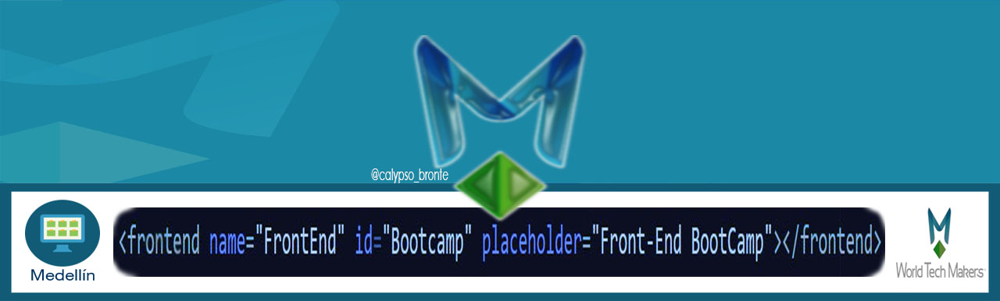

  

# Front-End Bootcamp

Codigo realizados en el BootCamp

* #### WebTask
  * [Pagina Web en Parejas]("Web Page")<!--Falta relizar la pagina-->

* #### Markdown
  * [Notas del BootCamp](/Notes/bootcamp-notes.md "BootCamp Notes")
  * [Hoja de Vida](/Curriculum-Vitae-Markdown/curriculum-vitae.md "Curriculum Vitae")

* #### HTML
  * [Hoja de vida](https://linamontano.github.io/FrontEnd_BootCamp/ "Curriculum Vitae")

* #### JS

* #### JQuery

  
  
  
  
  
  
 

   <footer>
      
 

  
  
       © 2017  -
         <a href="https://github.com/linamontano">Lina Montaño</a>
     

   </footer>
   

